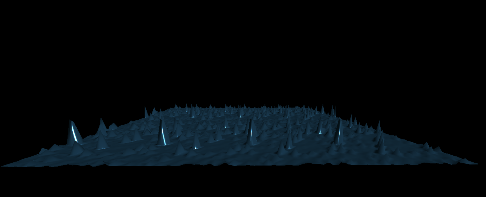

# Research Critical Data Framework Documentation

### Introduction
This framework delves into the study of digital and data cultures through the exploitation of gaps and inefficiencies, akin to arbitrage in financial markets. Through the lens of market dynamics, the tokenization of datasets into entities and links simulate a financial market. This framework transforms a conventional dataset, containing various entities and their interconnections, into a complex network of token/currency and token/token liquidity pools. Here, each 'node' or entity's value is determined by its price in native currency, thereby introducing a market perspective.

The inclusion of an arbitrage mechanism, which dynamically adjusts for price discrepancies across the dataset, reflects the self-correcting nature of markets. This mechanism not only provides a deeper understanding of market dynamics but also serves as a metaphor for the interconnectedness and fluidity of information in the digital age.

The arbitrage mechanism ensures that any increase in a node's value, which leads to price discrepancies within the dataset, is automatically "leveled out" through arbitrage, mirroring the self-correcting nature of capitalism. At its core, the framework employs the concept of arbitrage as both a metaphorical lens and a practical tool to navigate through and unveil the opaque practices of data commodification.

Arbitrage, in this context, symbolizes the act of exploiting discrepancies within data economies, serving as a critical lens to interrogate and deconstruct the hidden dynamics of power, surveillance, and the commodification of information, urging a reconsideration of ethical standards and democratic access in the digital age. This mechanism's dynamic nature allows for a novel form of interaction with Large Language Models (LLMs), where changes within the dataset can lead to real-time fine-tuning of the LLM's responses.

### Key Features and Implementation
This framework employs smart contract technology to tokenize datasets, creating a simulated market environment that reflects the complexities of real-world financial systems. Here's how it is implemented:

### Prerequisites

Before you begin, ensure you have the following installed:
- Docker
- Node.js and npm
- HardHat
- The Graph CLI

## Setup and Deployment
The setup involves initializing a Graph-Node environment, configuring HardHat for smart contract deployment, and deploying a subgraph to track the interactions within your dataset-turned-market.

### Initializing Graph-Node

Follow these steps to set up a local Graph-Node environment:

1. **Clone the Graph-Node Repository**
   Clone the repository to your local machine using:
   ```bash
   git clone git@github.com:graphprotocol/graph-node.git
   ```

2. **Modify the Docker Compose File**
   Navigate to the `graph-node/docker` directory and modify the `docker-compose.yml` file:
   - Change line 22 from:
     ```
     ethereum: 'mainnet:http://host.docker.internal:8545'
     ```
     To:
     ```
     ethereum: 'hardhat:http://host.docker.internal:8545'
     ```

3. **Start Docker**
   Ensure Docker is running on your machine.

4. **Launch the Graph-Node**
   In the terminal, navigate to the `./docker` directory and execute:
   ```bash
   docker-compose up
   ```
   This starts the local Graph-Node.

### Starting HardHat

To set up and start HardHat, follow these steps:

5. **Install Dependencies**
   ```bash
   cd hardhat && npm i
   ```

6. **Compile Smart Contracts**
   ```bash
   npx hardhat compile
   ```

7. **Start the Local Node**
   ```bash
   npx hardhat node
   ```

8. **Deploy Smart Contracts**
   Deploy Uniswap and OV contracts by running:
   - Uniswap:
     ```bash
     npx hardhat run scripts/deployUniswap.js --network localhost
     ```
   - OV:
     ```bash
     npx hardhat run scripts/deployOV.js --network localhost
     ```

### Deploying Subgraph to Local Graph-Node

To deploy your subgraph to the local Graph-Node, follow these steps:

9. **Navigate to the Subgraph Directory**
   ```bash
   cd subgraph
   ```

10. **Generate Code**
    ```bash
    graph codegen
    ```

11. **Build the Subgraph**
    ```bash
    graph build
    ```

12. **Create the Subgraph on the Local Node**
    ```bash
    graph create --node http://localhost:8020 graphname
    ```

13. **Deploy the Subgraph**
    ```bash
    graph deploy --node http://localhost:8020 --ipfs http://localhost:5001 graphname
    ```

### Creating Graph in HardHat

14. **Create Graph**
   Create graph by running:
     ```bash
     npx hardhat run scripts/createGraph.js --network localhost
     ```

### Querying the Subgraph

- Perform local queries by replacing `graphname` with the actual name of your deployed subgraph. Example query URL:
  ```
  http://localhost:8000/subgraphs/name/graphname/graphql?query=+query+MyQuery+%7B%0A+++++tokens%28first%3A+500%29+%7B%0A+++++++++id%0A+++++++++name%0A+++++++++address%0A+++++%7D%0A+++++pairs%28first%3A+500%29+%7B%0A+++++++++id%0A+++++++++token0%0A+++++++++token1%0A+++++++++address%0A+++++++++token1Name%0A+++++++++token0Name%0A+++++++++reserve1%0A+++++++++reserve0%0A+++++%7D%0A+%7D
  ```

### Cleanup

- **Important**: When shutting down the graph-node, remember to delete the latest generated data at `docker/data`. 

15. **Remove the Subgraph**
    ```bash
    graph remove --node http://localhost:8020 graphname
    ```

### Viewing Data via D3 Graph or D3 Mesh


14. **open local graph.html file**
   Update any WETH address in webclient/main.js 
   Update fetch method (local json or HardHat node)


## Demonstration Videos

###Demo 1: Node Weight Change Impact 

[](https://www.youtube.com/watch?v=w1ACORJNVp4)

This demo showcases how changing the weight of a node affects the response of a Large Language Model (LLM). It provides a practical example of the framework's critique on data value and representation.

###Demo 2: Weight Discrepancies and Arbitrage Opportunity

[](https://www.youtube.com/watch?v=65zHikzmyQs)

The second demo illustrates the effect of weight discrepancies and arbitrage opportunities on shifting the response of the LLM, highlighting the framework's use of arbitrage as a critical lens.

### Demo 3: Large Scale Dataset

[](https://www.youtube.com/watch?v=v3d7eWChAQ8)

Demonstrating the framework's concepts on a larger scale using a Kaggle NLP training dataset, this video combines the effects of node weight changes and arbitrage opportunities, showcasing the extensive application of the Critical Data Framework.
